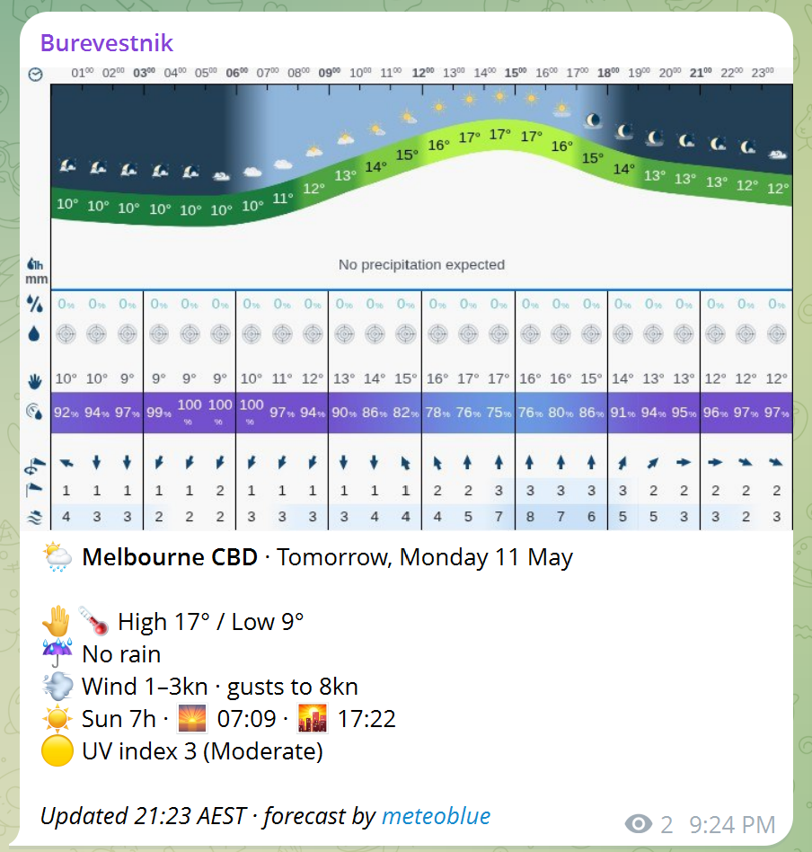

# burevestnik

[](https://github.com/ozgliderpilot/burevestnik/actions/workflows/post.yml)

Burevestnik (буревестник, "stormy petrel") is a small bot that flies to meteoblue twice a day, screenshots Melbourne CBD's hourly forecast, and squawks the result into a Telegram channel.



## How it flies

```
scrape (Playwright)  →  parse (HTML → Forecast)  →  caption (Forecast → str)  →  send (Telegram)
```

Side effects live at the edges; the middle is pure and tested against a fixed HTML fixture. A GitHub Actions cron flaps the wings every 12 hours.

## Run it yourself

```sh
uv sync --extra dev --frozen
uv run playwright install chromium
uv run python -m burevestnik.main  # needs TELEGRAM_BOT_TOKEN and TELEGRAM_CHAT_ID
```

For architecture invariants, CI modes, and parser internals, see [CLAUDE.md](CLAUDE.md).
